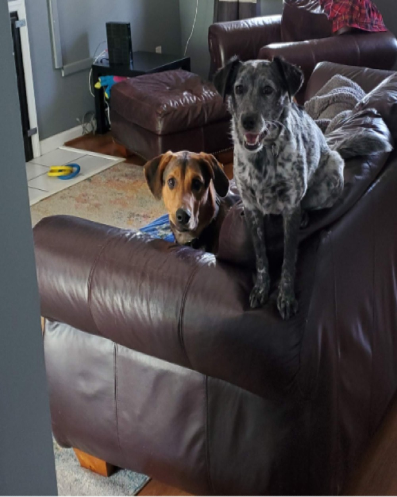

# Welcome to My GitHub Pages Site 

> 🚀 **Quickstart:** Clone, edit Markdown, push, and your site updates instantly.

---

## 🚩 Features

- 🌐 **Instant Deployment**: Updates on every `git push`.
- 🎨 **Customizable Themes**: Change `_config.yml` to tweak appearance.
- 📄 **Markdown Powered**: Write in plain text—no HTML required.
- 📋 **Navigation Ready**: Easily link multiple pages.

### 📑 Table of Contents

1. [Home](index.html)
2. [About](about.html)

---

## 🛠 Getting Started

```bash
git clone https://github.com/<username>/my-pages.git
cd my-pages
```

> 🔧 **Pro Tip:** Use `git checkout -b feature/awesome` to manage new pages.

## ✅ Next Steps

- [ ] Create new pages with `vim mypage.md`
- [ ] Customize `_config.yml`
- [ ] Add assets in `assets/`

---

[^1]: Markdown is awesome! See [GitHub Markdown Guide](https://guides.github.com/features/mastering-markdown/).
